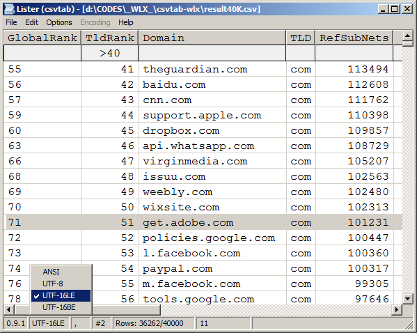

**csvtab-wlx** is a [Total Commander](https://www.ghisler.com/) plugin to view CSV files.

|[**Download the latest version**](https://github.com/little-brother/csvtab-wlx/releases/latest/download/csvtab.zip)|
|-------------------------------------------------------------------------------------------|

### Features
* Auto-detect codepage and delimiter
* Column filters
* Sort data by column click
* Supports ANSI, UTF8 and UTF16

If you have any problems, comments or suggestions, check [Wiki](https://github.com/little-brother/csvtab-wlx/wiki), create [issue](https://github.com/little-brother/csvtab-wlx/issues) or just let me know <a href="mailto:lb.im@ya.ru?subject=csvtab-wlx">lb.im@ya.ru</a>.